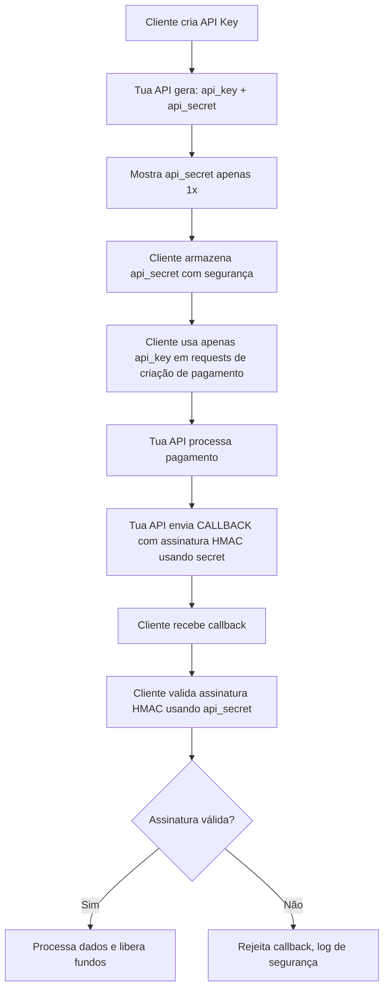

# 🔑 AngolaPay SaaS – Módulo de API Keys

Este documento descreve o **módulo de API Keys** da plataforma AngolaPay SaaS, incluindo criação, gestão, segurança e callbacks para notificação de status de transações.

---

## 1️⃣ Objetivo

Permitir que clientes integrem suas aplicações externas com a plataforma AngolaPay, recebendo notificações de transações e saques via **callback URL**, de forma:

- Segura  
- Rastreável  
- Limitada a IPs autorizados  

---

## 2️⃣ Estrutura da API Key

Cada API Key conterá:

| Campo          | Descrição                                               |
| -------------- | ------------------------------------------------------- |
| `reference`    | Identificador único da API Key (ID da chave)           |
| `title`        | Nome da API Key fornecido pelo usuário                 |
| `callback_url` | URL segura (HTTPS) para receber notificações de eventos |
| `wallet_id`    | Carteira de destino onde os fundos serão creditados    |
| `ips`          | Lista de IPs autorizados a usar a API Key             |
| `secret`       | Chave privada usada para assinar e validar callbacks  |

> Esta estrutura garante **controle total sobre quem pode usar a chave, para onde os fundos vão e para onde os eventos são notificados**.

---

## 3️⃣ Criação de API Key

Ao criar uma API Key, o usuário deve fornecer:

- `title` → Nome identificador  
- `callback_url` → URL de callback POST (HTTPS obrigatório)  
- `wallet_id` → Carteira de destino  
- `ips[]` → Lista de IPs autorizados  

### Regras para callback_url

- HTTPS obrigatório  
- Deve usar método POST  
- Receberá notificações quando o status de qualquer pagamento ou saque mudar  

### Payload do callback

```json
{
  "intern_transaction_id": "",
  "extern_transaction_id": "",
  "status": "initiated|pending|processing|paid|failed|completed",
  "amount": 0,
  "timestamp": ""
}
```

> Cada callback é **assinada com HMAC-SHA256** usando o `secret` da API Key, garantindo integridade e autenticidade.

---

## 4️⃣ Gestão de API Keys

| Ação             | Descrição                                                                    |
| ---------------- | ---------------------------------------------------------------------------- |
| `createApiKey()` | Cria nova chave com referência, title, callback_url, wallet_id e IPs válidos |
| `rotateApiKey()` | Rotaciona secret da chave mantendo a mesma API Key ID                        |
| `revokeApiKey()` | Revoga a chave imediatamente, bloqueando acesso                              |
| `listApiKeys()`  | Lista todas as API Keys ativas do usuário                                    |

> Todas as ações devem ser auditadas e registradas no ledger de segurança.

---

## 5️⃣ Segurança das API Keys

- Secret gerada aleatoriamente, **armazenada hashada no banco**  
- Escopos limitados (ex: `transactions:write`)  
- IP binding obrigatório: apenas IPs autorizados podem usar a chave  
- Rotação periódica da secret para segurança adicional  
- Rate limiting por API Key e endpoint  
- Callbacks assinadas com **HMAC-SHA256**  
- Logs de eventos para auditoria  

---

## 6️⃣ Boas práticas para callback_url

- Responder sempre com **HTTP 200 OK**  
- Validar assinatura HMAC de cada payload  
- Implementar retry com backoff exponencial se falhar  
- Evitar processamento pesado diretamente no endpoint, usar fila ou worker  
- Garantir que apenas IPs autorizados consigam acessar a API  

---

## 7️⃣ Fluxo de Uso – API Keys e Webhooks



---

## 8️⃣ Checklist de Implementação

- [ ] Endpoint para criação de API Key (`title`, `callback_url`, `wallet_id` e `ips` obrigatórios)  
- [ ] Validação de HTTPS e método POST para callback_url  
- [ ] Validação de IPs autorizados para a API Key  
- [ ] Escopos definidos e validados  
- [ ] Armazenamento seguro da secret (hash)  
- [ ] HMAC-SHA256 nos callbacks  
- [ ] Auditoria completa de criação, rotação e revogação  
- [ ] Rate limiting por API Key  
- [ ] Retry e backoff para callbacks falhos  

---

> Este documento serve como guia completo para implementar o **módulo de API Keys da AngolaPay SaaS**, garantindo:

- Integração segura  
- Notificações confiáveis  
- Rastreabilidade  
- Controle granular por IP e wallet  
