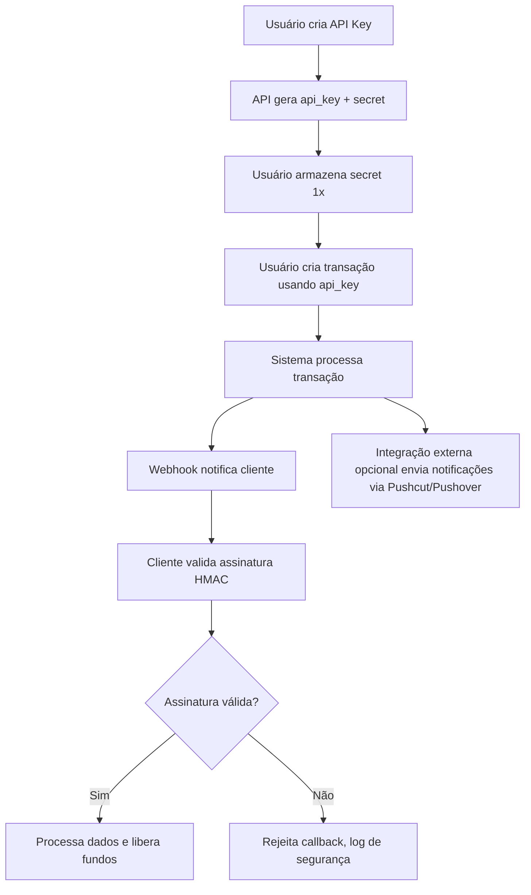

# 🍍 PlinqPay – Plataforma SaaS de Pagamentos Angolanos

PlinqPay é uma **plataforma SaaS de gateway de pagamento** que permite aos clientes integrar pagamentos angolanos de forma segura, rastreável e escalável. A plataforma oferece:

- Criação e gestão de **API Keys**
- Registro e validação de usuários (KYC)
- Criação de transações com referência ou QR ()
- Webhooks para notificações em tempo real
- Integrações externas de notificações (Pushcut, Pushover, etc.)
- Controle de wallets e saques
- Segurança robusta em todas as camadas

---

URL : https://plinqpay.com/
CRIADO POR : FRANCISCO LOMBO DIAKOMAS

## 1️⃣ Objetivos do Projeto

- Facilitar o acesso a APIs de pagamento locais
- Garantir **segurança e rastreabilidade** de todas as operações
- Permitir integração externa via **API Key e webhooks**
- Preparar a plataforma para notificações externas e futuras integrações de push nativo

---

## 2️⃣ Módulo de API Keys

### Estrutura da API Key

| Campo     | Descrição                                            |
| --------- | ---------------------------------------------------- |
| `title`   | Nome da API Key fornecido pelo usuário               |
| `publick` | Chave publica usada para assinar e validar callbacks |
| `secret`  | Chave privada usada para assinar e validar callbacks |

### Criação e Gestão

- Usuário fornece: `title`, `callback_url`, `wallet_id`, `ips[]`
- `secret` gerada aleatoriamente e mostrada **uma única vez**
- Funções principais: `createApiKey()`, `rotateApiKey()`, `revokeApiKey()`, `listApiKeys()`

### Segurança

- Secret armazenada hashada
- IP binding obrigatório
- Escopos limitados (`transactions:write`)
- Rate limiting por API Key
- Callbacks assinadas com HMAC-SHA256
- Logs de auditoria

---

## 3️⃣ Validação de Usuários (KYC)

- Todos os usuários devem ser **validados antes de saques**
- Processo de KYC inclui:
  - Envio de documentos oficiais
  - Conferência de identidade
  - Aprovação manual ou automática
- Status do usuário controlado como: `pending`, `verified`, `rejected`
- Apenas usuários `verified` podem criar saques

---

## 4️⃣ Módulo de Transações

- Tipos de pagamento: **Referência**
- Dados necessários para cada transação:
  - `amount` → Valor da transação
  - `wallet_id` → Carteira de destino do cliente
  - `transaction_id` → Identificador único interno
  - `description` → O que está sendo pago
- Fluxo de segurança:
  1. Cliente envia request de pagamento usando `api_key`
  2. Sistema gera transação e referência
  3. Webhook notifica mudanças de status (`initiated`, `pending`, `paid`, `failed`)
  4. Cliente valida assinatura HMAC usando `secret`

---

## 5️⃣ Webhooks e Callbacks

- Cada API Key permite configurar **callback_url** para eventos de pagamento e saque
- Payload padrão:

```json
{
  "intern_transaction_id": "",
  "extern_transaction_id": "",
  "status": "initiated|pending|processing|paid|failed|completed",
  "amount": 0,
  "timestamp": ""
}
```

- Segurança:
  - HMAC-SHA256 usando `secret`
  - Timestamp para evitar **replay attack**
  - Idempotência via `event_id`

---

## 6️⃣ Integrações Externas de Notificação

- Suporte para serviços como **Pushcut, Pushover, OneSignal**
- Configurável pelo usuário:
  - `callback_url` → URL do serviço externo
  - `method` → Método HTTP (`POST`, `PUT`)
  - `body_template` → Modelo de payload JSON
  - `headers` → Cabeçalhos adicionais (`Authorization`, `Content-Type`)
  - `events[]` → Tipos de eventos
- Cada callback pode ser assinado com HMAC-SHA256

---

## 7️⃣ Fluxo Consolidado do Sistema



---

## 8️⃣ Segurança Geral

- HMAC-SHA256 em todos os callbacks
- IP binding para API Keys
- Rate limiting e auditoria completa
- Retry e backoff em callbacks falhos
- Hash seguro para secrets

---

## 9️⃣ Checklist de Implementação

- [ ] API Keys: criação, rotação, revogação, listagem
- [ ] Validação de usuários (KYC) antes de saques
- [ ] Criação e controle de transações
- [ ] Webhooks com HMAC-SHA256, idempotência e timestamp
- [ ] Integrações externas configuráveis (method, headers, body_template)
- [ ] Logs, auditoria e rate limiting
- [ ] Fluxo de segurança end-to-end

---

> Este README resume o projeto **PlinqPay**, fornecendo visão completa do sistema, fluxos, módulos e práticas de segurança para integração de pagamentos e notificações.
